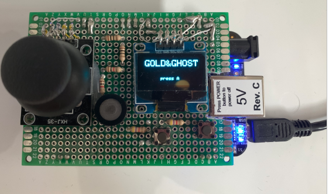

# gold-ghost
Game: Gold&Ghost

HW
    1. Beaglebone black
    2. DIY cape:
    • i2c OLED 0.96” display
    • HXJ-35 joystick
    • I2C 0.96” display
    • Buttons, resistors, buzzer, etc…

SW
Inspired by: 

    • https://github.com/flightcrank/pong 
    
    • http://exploringbeaglebone.com/ (Darek Molloy)

Game play:

	
